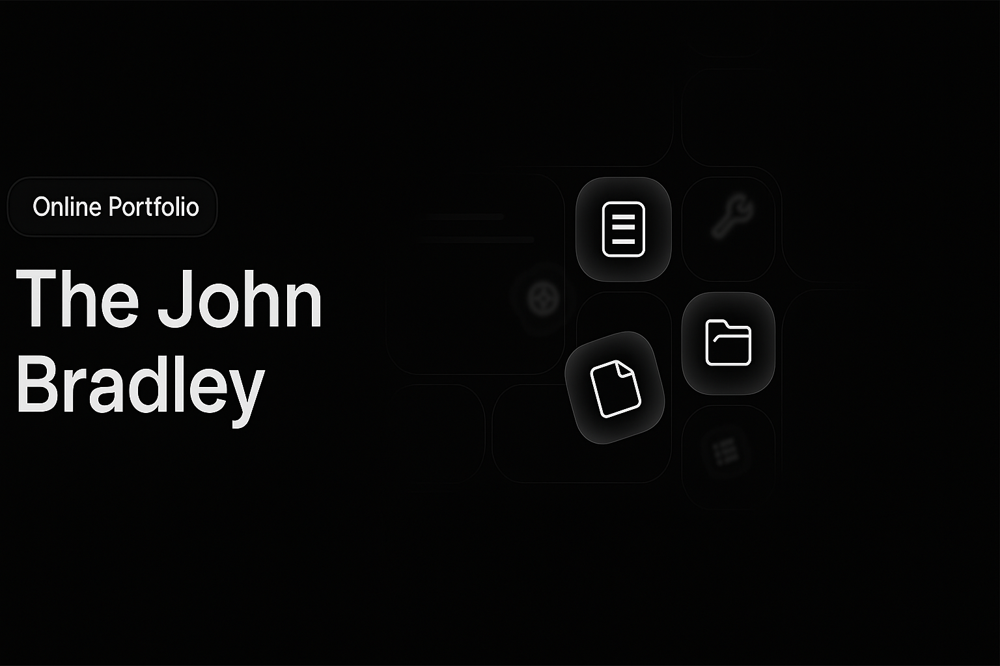

🚀 Sleek, Professional README & Stat Cards

  <a href="https://thejohnbradley.net?ref=readme"> <b style="font-size: 1.15rem; color: #2563eb;">Find my projects and writings here</b> </a> 

🌟 Statistics

 

 

